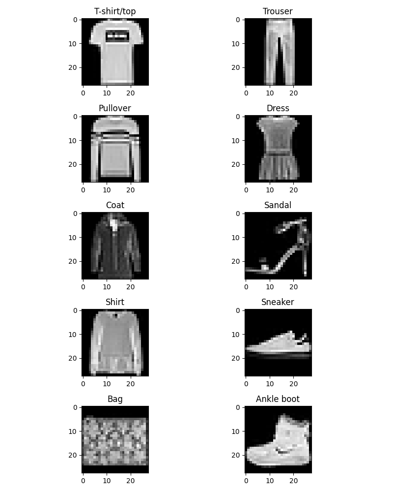
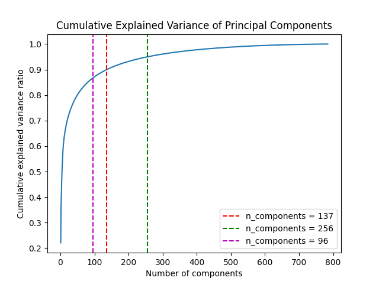
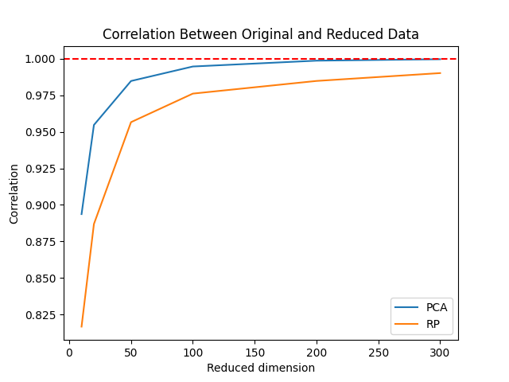

# Discovering Structure in Fashion-MNIST Using Dimensionality Reduction and Clustering

This project explores the internal structure of the Fashion-MNIST dataset using unsupervised learning methods. The goal is to understand how well dimensionality reduction and clustering algorithms can recover meaningful clothing categories without using labels during training.

The project compares PCA, Gaussian Random Projection, K-Means clustering, and Spectral Clustering on standardized Fashion-MNIST image data.

This project investigates three main questions:

1. How many principal components are needed to preserve most of the variance in Fashion-MNIST?
2. How well do PCA and Random Projection preserve pairwise distances?
3. How do K-Means and Spectral Clustering compare when applied to the original and PCA-reduced feature spaces?

## Dataset

Fashion-MNIST contains 70,000 grayscale images of clothing items, each represented as a 28 × 28 image. After flattening, each image becomes a 784-dimensional feature vector.

Fashion-MNIST has 10 classes:

## Methods

### 1. Dimensionality Reduction

Two dimensionality reduction methods are evaluated:

* Principal Component Analysis (PCA)
* Gaussian Random Projection

For PCA, the cumulative explained variance is used to identify useful reduced dimensions:

| PCA Representation | Number of Components |
| ------------------ | --------------------:|
| PCA 90%            | 137                  |
| PCA 95%            | 256                  |
| PCA Elbow          | 96                   |

The PCA elbow point retains approximately 86.8% of the cumulative variance while substantially reducing dimensionality.

### 2. Distance Preservation

To evaluate how well dimensionality reduction preserves the geometry of the original data, a random subset of 5,000 Fashion-MNIST samples was used. The Pearson correlation between original-space distances and reduced-space distances is used as the distance preservation metric. Higher correlation indicates that the reduced representation better preserves the original pairwise distance structure.

| Reduced Dimension | PCA Correlation | Random Projection Correlation |
| ----------------- | ---------------:| -----------------------------:|
| 10                | 0.8937          | 0.8169                        |
| 20                | 0.9546          | 0.8870                        |
| 50                | 0.9847          | 0.9565                        |
| 100               | 0.9946          | 0.9760                        |
| 200               | 0.9986          | 0.9847                        |
| 300               | 0.9995          | 0.9901                        |

PCA preserves pairwise distances better than Gaussian Random Projection at every tested dimension, especially when the target dimension is small.

### 3. Clustering

The project evaluates two clustering algorithms:

* K-Means
* Spectral Clustering

Because clustering labels are arbitrary, predicted cluster labels are aligned with true class labels using the Hungarian algorithm before computing accuracy.

The clustering results are evaluated using:

* Hungarian-aligned accuracy
* Adjusted Rand Index (ARI)
* Normalized Mutual Information (NMI)
* Confusion matrices
* Runtime

ARI and NMI are computed using the raw cluster labels because they are invariant to label permutations.

## Results

### K-Means on the Full Dataset

K-Means was first evaluated on the full Fashion-MNIST dataset using the original standardized features and several PCA-reduced representations.

| Method  | Representation | Accuracy | ARI    | NMI    | Time (s) |
| ------- | -------------- | --------:| ------:| ------:| --------:|
| K-Means | Original       | 0.4844   | 0.3482 | 0.5050 | 12.69    |
| K-Means | PCA 90%        | 0.5201   | 0.3689 | 0.5068 | 5.82     |
| K-Means | PCA 95%        | 0.4832   | 0.3355 | 0.4889 | 8.52     |
| K-Means | PCA Elbow      | 0.5187   | 0.3412 | 0.4960 | 3.43     |

PCA 90% achieved the highest K-Means accuracy on the full dataset, while PCA Elbow gave a similar accuracy with fewer dimensions and shorter runtime.

### K-Means vs Spectral Clustering on a Subset

Spectral Clustering is computationally more expensive than K-Means, so both K-Means and Spectral Clustering were compared on the same random subset of 20,000 samples.

| Method              | Representation   | Accuracy | ARI    | NMI    | Time (s) |
| ------------------- | ---------------- | --------:| ------:| ------:| --------:|
| K-Means             | Original         | 0.5093   | 0.3459 | 0.5148 | 2.33     |
| K-Means             | PCA 90%          | 0.4933   | 0.3375 | 0.4886 | 1.92     |
| K-Means             | PCA 95%          | 0.5224   | 0.3707 | 0.5338 | 1.83     |
| K-Means             | PCA Elbow        | 0.5516   | 0.3660 | 0.5055 | 1.08     |
| Spectral Clustering | Original         | 0.5416   | 0.4198 | 0.6316 | 62.36    |
| Spectral Clustering | PCA 90%          | 0.5584   | 0.4372 | 0.6188 | 37.65    |
| Spectral Clustering | PCA 95%          | 0.5494   | 0.4304 | 0.6374 | 46.11    |
| Spectral Clustering | PCA Elbow        | 0.5580   | 0.4358 | 0.6168 | 37.82    |

Spectral Clustering generally outperformed K-Means in ARI and NMI, suggesting that graph-based clustering captures more meaningful structure in Fashion-MNIST. PCA 90% gave the best Spectral Clustering accuracy, while PCA 95% gave the highest NMI.

### Additional Results

The `figures/` directory contains confusion matrices and PCA-based cluster visualizations for all clustering experiments.

## Key Findings

* PCA preserves pairwise distances better than Random Projection at the same reduced dimension.
* K-Means benefits from moderate PCA dimensionality reduction, especially PCA 90% and PCA Elbow.
* Spectral Clustering achieves stronger ARI and NMI scores than K-Means on the same subset.
* PCA can reduce runtime for both K-Means and Spectral Clustering.
* Fashion-MNIST is difficult to cluster perfectly because visually similar categories, such as shirt, T-shirt/top, pullover, and coat, overlap strongly in pixel space.
* Spectral Clustering provides better structure recovery but requires substantially more computation than K-Means.

## How to Run

This project was developed in Google Colab. Run notebooks in order:

Setup

Discovering Structure in Fashion-MNIST

## Author

Yi-Heng Tsai
